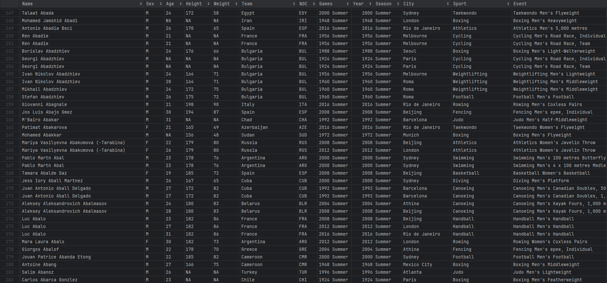
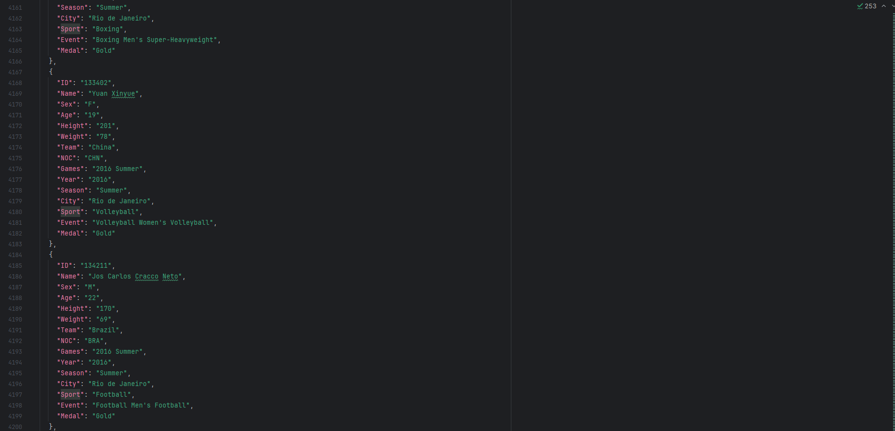

# Rendu JS Ramda

Ce projet vise à prédire des résultats aux différentes épreuves des Jeux Olympiques en fonction des précédentes éditions.

## Fonctionnement :

Un fichier csv archivant l'intégralité des participants aux éditions passées des jeux olympiques sert de base de donnée principale, les lignes pertinentes en sont ensuites extraites et compilées dans un .json qui tes finalement traité pour sortir une liste d'athlètes ayant de grandes chances d'être champions olympiques en 2024.

### Forme des données .csv :

### Forme des données .json :

## Equipe de développement : 

- Félix Courtin 
- Theo Lucq

 
